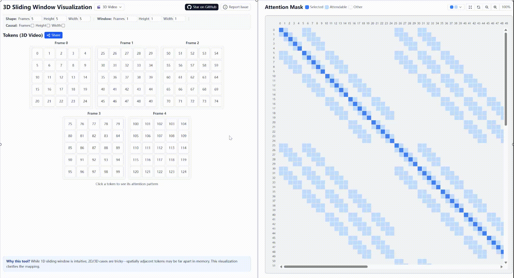
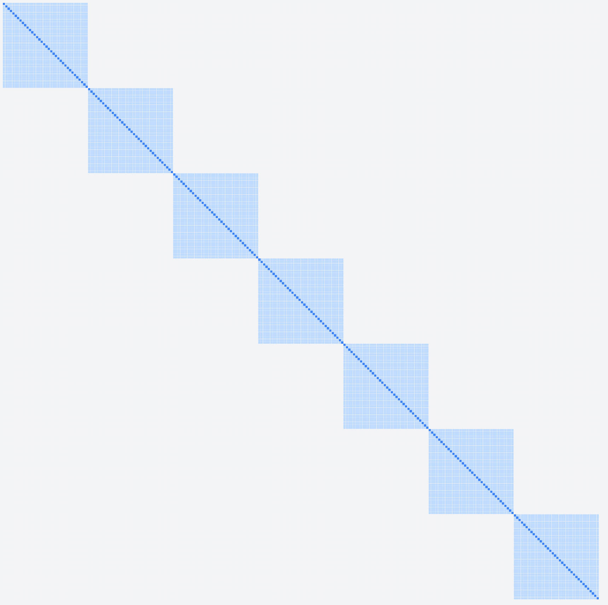
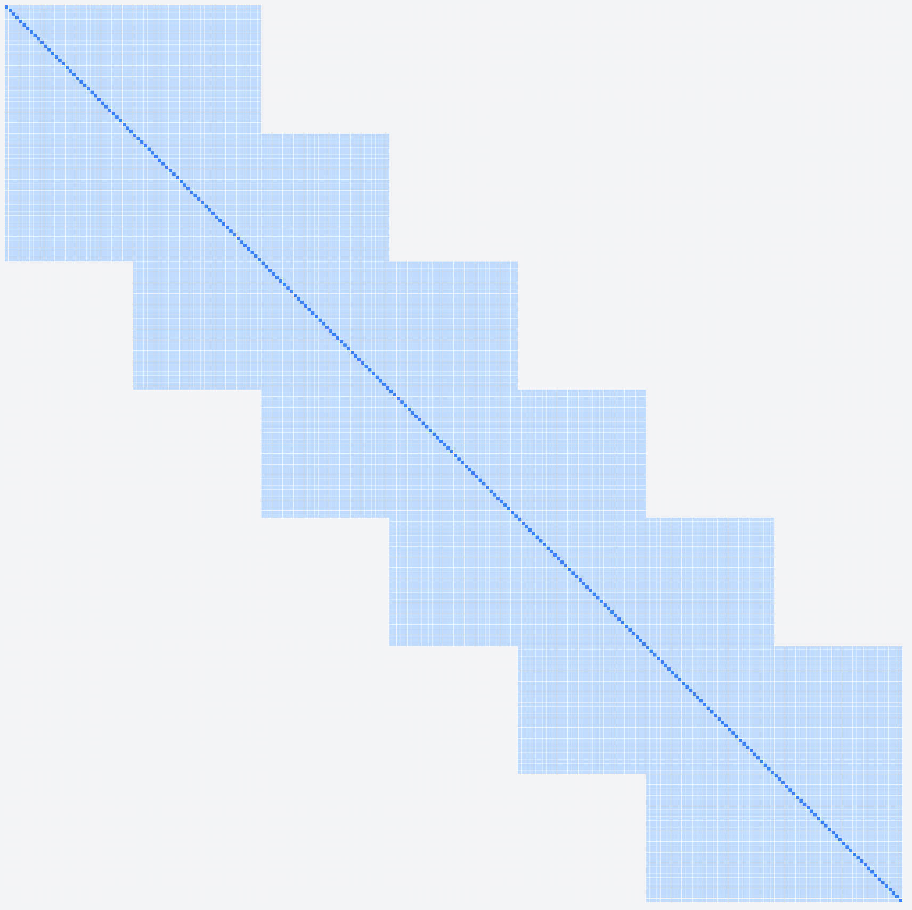
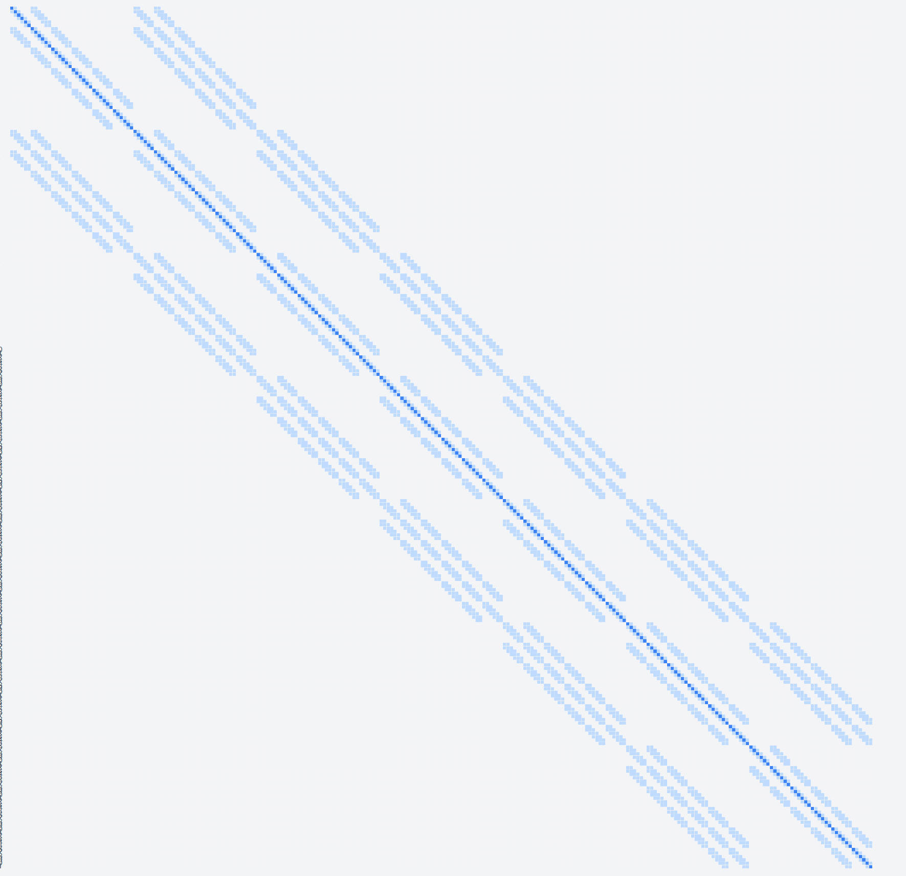

# Sliding Window Visualization

[](https://niyunsheng.github.io/posts/visualizing-3d-attention-bridging-the-gap-between-1d-sequences-and-3d-space/)
[](./LICENSE)

An interactive visualization tool for understanding sliding window attention patterns across 1D, 2D, and 3D spaces. 🔍

**Why this tool?** While 1D sliding window is intuitive, 2D/3D cases are tricky—**spatially adjacent tokens may be far apart in memory, and memory-adjacent tokens may be far apart spatially**. This visualization clarifies the mapping and helps you design effective sparse attention patterns for multi-dimensional data like images or videos.



## Attention Pattern Examples

To help build intuition, here are four different sliding window configurations with $F=7, H=W=6$:

<table>
  <tr>
    <td align="center">
      
      <br>
      <b>Fig. 2: Full Temporal, No Spatial</b><br>
      <small>Attends to all frames in temporal, only self in spatial.</small>
    </td>
    <td align="center">
      
      <br>
      <b>Fig. 3: No Temporal, Full Spatial</b><br>
      <small>Attends only to current frame, all spatial positions.</small>
    </td>
  </tr>
  <tr>
    <td align="center">
      
      <br>
      <b>Fig. 4: Limited Temporal, Full Spatial</b><br>
      <small>Sliding window of 3 frames, all spatial positions.</small>
    </td>
    <td align="center">
      
      <br>
      <b>Fig. 5: Limited Temporal, Limited Spatial</b><br>
      <small>Sliding window of 3 frames, 3×3 spatial neighborhood.</small>
    </td>
  </tr>
</table>


## Get Started

### Web Demo

Visit the live demo at: https://niyunsheng.github.io/sliding-window-viz-3D/

### Python

Python reference implementation is available in the `python/` directory. For algorithm implementation details, see [python/README.md](python/README.md).

### Development

```bash
npm install      # Install dependencies
npm run dev      # Start dev server
npm run build    # Build for production
npm run deploy   # Deploy to GitHub Pages
```

## Acknowledgments

Special thanks to Claude for assistance with the web visualization code.
